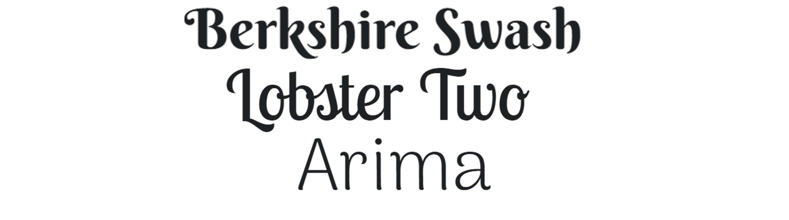

# Love Venom

# Contents

* [**User Experience (UX)**](<#user-experience-ux>)  
    * [User Stories](<#user-stories>)  
    * [Colour Scheme](<#colour-scheme>)  
    * [Typography](<#typography>)  
    * [Wireframes](<#wireframes>)  
* [**Features**](<#features>)  
    * [Existing Features](<#existing-features>)  
        * [Navigation Bar](<#navigation-bar>)  
        * [Additional Navigation](<#additional-navigation>)  
        * [Landing Page](<#landing-page>)  
        * [Vertebrate and Invertebrate Sub-pages](<#vertebrate-and-invertebrate-sub-pages>)  
        * [Seperate Type of Animal Sub-pages](<#seperate-type-of-animal-sub-pages>)  
        * [Footer](<#footer-with-social-media-links>)  
        * [Contact Page (with Confirmation Page)](<#contact-page-with-validation-and-a-confirmation-page>)  
    * [Features Left to Implement](<#features-left-to-implement>)  
* [**Technologies Used**](<#technologies-used>)  
* [**Testing**](<#testing>)  
* [**Deployment**](<#deployment>)  
    * [Github Pages](<#deployment-with-github-pages>)  
    * [Local Deployment](<#local-deployment>)  
* [**Credits**](<#credits>)  
    * [Content](<#content>)
    * [Media](<#media>)
    * [Acknowledgements](<#acknowledgements>)

# Overview of project
‘Love Venom’ is a site that aims to provide accurate educational content about venom and animal poisons and the animals that produce them. This site will be useful for anyone who has an interest in venom, animal poison or animals in general and is intended for adults and children aged 12+.

Target audience: 

Click [here](https://ui.dev/amiresponsive?url=https://dragon-fire-fly.github.io/venom/index.html) to view responsive mockup

<!-- Update responsive mockup !! -->

Click [here](https://dragon-fire-fly.github.io/venom/index.html) for the live website.

# User Experience (UX)
Love Venom was designed to provide a simple and easily navigatable website with a focus on large, high quality photos and accompanying text.
## User Stories
As a user, I would like to be able to:
- be able to learn about both vertebrate and invertebrate venomous animals
- read about a range of specific venomous animals
- access the Love Venom website from both desktop and mobile devices
- be able to access Love Venom from any browser of my choice
- be able to easily contact the site owner and sign up for a newsletter

## Colour Scheme
Various colour pallettes were explored in preparation for this project using https://coolors.co/ and https://mycolor.space/. 

An overall green theme was desired to be inkeeping with the venomous theme. 

The colour #DDE7C7 was chosen from a [coolers](https://coolors.co/) generated theme. This colour was set as the central colour in [mycolorspace](https://mycolor.space/) and a variety of pallettes were generated. Two colours from the "Generic Gradient" pallette were chosen, as shown below.

Additional colours were required for the footer element. For this, a blue colour from the spider image to be displayed on each page as the footer (footer-spider-img.jpeg) was selected using the [Eye Dropper](https://eyedropper.org/) extension. This colour was #02789E. This colour was set as the central colour in [mycolorspace](https://mycolor.space/) and a variety of pallettes were generated. Three colours from the "Random Shades" pallette were used, as shown below.

A medium bright green (#126100) was chosen from a [coolers](https://coolors.co/) generated theme for the main title/logo.

The hex codes shown above were converted to rgb colours values to be used for the --root values in the style.css style. This enabled the opacity to be set using a rgba value.

    background-color: #dde7c7 = rgb(221,231,199);
    nav-bar-color: #87b69b = rgb(135,182,155);
    black: #000000 = rgb(0,0,0);
    white: #fff = rgb(255,255,255);
    l-blue: #98e9ff = rgb(152,233,255);
    d-blue: #02789e = rgb(2,120,158);
    social-media: #003859 = rgb(0,56,89);
    h1-color: #126100 = rgb(18,97,0);

## Typography
The following fonts were selected from Google Fonts:
- _Berkshire Swash_ was chosen for the main "Love Venom" logo and h2 titles as it is a large, bold font with a calligraphic flair, perfect for titles.
- _Lobster Two_ was chosen for the nav bar and main page photo labels as it is a visually appealing, joined-up style which is still easier to read. The Lobster family of fonts have different versions of each letter and the optimal variation is automatically selected to best fit its position in the word, ensuring an aesthetically pleasing joined-up effect.. Lobster Two has thinner text than the original Lobster text which makes it appear a little more delicate. 
- _Arima_ was chosen for the main body text as it retains a calligraphic charachter but is an easily readable font with generous line spacing.

All fonts were set as --root values and had _sans-serif_ set as a fall-back font in the case that the specific fonts could not be loaded.

FontAwesome icons were used for social media buttons ([Facebook](https://fontawesome.com/search?q=facebook&s=solid%2Cbrands), [Instagram](https://fontawesome.com/search?q=instagram&s=solid%2Cbrands) and [Twitter](https://fontawesome.com/search?q=twitter&s=solid%2Cbrands)) and collapible nav menu ([Bars menu](https://fontawesome.com/search?q=bars&s=solid%2Cbrands)).

## Wireframes

The following wireframes were created using Balsamiq Wireframes:

| Name  | Wireframe  |
|---|---|
| Simple Sitemap  |   | 
|  Expanded Sitemap |   |
| Home page |   |
| Vertebrates page  |   |
| Invertebrates page  |  |
| Example page (reptiles)  |   |
| Contact page  |   |

# Features
<!-- Briefly explain the project here (consistency accross different pages, formatted according to best practice, good quality, non-distorted images) -->

## Existing Features

<!-- Add screenshot of each! -->
### Navigation bar
- Featured on every page of the site and uses consistent colours and typography
- Features the main "Love Venom" logo, "Home", "Vertebrates", "Invertebrates", "Contact"
- Allows user to quickly navigate between sections of the website without having to use the "back" button on thier browser
- Adaptive design for different screen sizes and collapses into a "burger menu" for smaller mobile devices (600 pixels or smaller)
- Allows user to know which section they are currently on by underlining that section's name on the menu

### Additional navigation
The site uses two forms of additional naviagation to aid the user:
- Back-to-top button at the bottom of the page which is fixed in position so it can be accessed from anywhere on the page. This allows the user to easily return to the top of the page to make use of the navigation features. This is positioned at the bottom of the page in the centre, and adjusts in size and position responsively.
- "Bread-crumbs" navigation so that intermediate pages may be accessed from the information pages without having to use the "back" button on the browser. This also reminds the user exactly where they are on the website. This navigation is kept small at the top of the page so as not to distract from the main content. The clickable links transform to uppercase in response to being hovered over.

### Landing page 
- Welcomes users and briefly describes the purpose of the site
- Features the ability to select between vertebrates and invertebrate sections and links to these sections by clicking the photo or title
- Features high quality, non-distorted images positioned using CSS grid
- Images are responsive to different screen sizes and change between being side-by-side or stacked on top of eachother, depending on screen size of device

### Vertebrate and Invertebrate Sub-pages
- Two sub-pages, one each for vertebrates and invertebrates
- Features high quality, non-distorted images positioned using CSS grid
- Images are responsive to different screen sizes and change between being side-by-side or stacked on top of eachother, depending on screen size of device
- Features the ability to select between different animal sections and links to these sections by clicking the photo or title

### Seperate Type of Animal Sub-pages
- The site is further sub-divided into eight sections: 
* [Reptiles](reptiles.html)  
* [Amphibians](amphibians.html)   
* [Fish](fish.html)  
* [Mammals-and-Birds](mammals-and-birds.html)  
* [Spiders](spiders.html)  
* [Scorpions](scorpions.html)  
* [Insects-and-other-arthropods](insects.html)  
* [Marine-invertebrates](marine-inverts.html)

### Footer with social media links
- Featured on every page of the site and uses consistent colours and typography
- Links to external social media accounts. As this is a mock website, it is not associated with real social media accounts and therefore the links open the home pages of the relevant social media sites. These links open in a new tab.
- Features a high-quality photo of a spider on a leaf with a blue background. Shades similar to this blue were used for the banner and social media icons also featured in the footer in order to complement each other. Various amounts of opacity were applied to the banner depending on the screen size to ensure the spider can be seen through the banner when relevant.
- Spider photo is fixed in position so as the user scrolls to the footer, the spider is revealed

### Contact page with validation and a confirmation page
- Features a high quality image of a spider's web with dew drops
- Features contact form with form validation so that the user may leave feedback or request to join the mailing list
- The input boxes have a green border around them when hovered over. The submit button also changes to contrasting colours when hovered over. These features provide feedback to the user to know where they are potentially about to click

- Features a confirmation page which the user is directed to after sucessful submission of the form

## Features Left to Implement
1. What is venom? What is the difference between venoms and poisons?

# Technologies used
- HTML5 for providing the core structure of the website pages
- CSS3 for styling the HTML documents
- [Gitpod](https://gitpod.io/) as a developer platform
- [Github](https://github.com/) as a code hosting platform
- [Git](https://git-scm.com/) for source code management
- [Balsamiq](https://balsamiq.com/) for creating wireframes at the start of the project to help guide HTML and CSS coding
- [Photopea](https://www.photopea.com/) for cropping some of the photos
- CSS grid for positioning elements within the style.css file
- --root values in the style.css file for consistency and ease of alteration of colours and fonts

# Testing
For details of all testing, please refer to the [TESTING.md](TESTING.md) file.

# Deployment
## Deployment with GitHub Pages
The site was deployed to GitHub Pages by taking the following steps:
1. Click on the "Settings" tab in the Github respository for the project
2. Find and click on the "Pages" subsection on the left-hand menu bar
3. Under "Source", select "Branch: main" and click save
4. After a few miunutes, the site should be successfully deployed and the link may be found under "Environments" on the right hand side of the repository page.
5. From here, the "View Deployment" button may be paressed to lead directly to the deployed site.

## Local deployment
To create a local copy of this project on another computer, the following steps may be followed:
1. Locate the repository of [the project you would like to copy](https://github.com/dragon-fire-fly/venom) 
2. In the top-right corner of the repository click on the "fork" button
3. Navigate to your fork of the project and above the list of files, click "Code"

# Credits
## Content
- [This W3schools Tutorial](https://www.w3schools.com/howto/howto_js_topnav_responsive.asp) was used to help implement a simple JavaScript based navigation menu to help make the menu options more legible on smaller screen sizes.
- [CSS Grid Garden](https://cssgridgarden.com/) was used to learn how to create effective CSS grid layouts
- All factual text content came from [Wikipedia](https://en.wikipedia.org/).
- Fonts were imported from [Google Fonts](https://fonts.google.com/)
- Icons were imported from [FontAwesome](https://fontawesome.com/)

## Media

Image credits for all images used can be found here:

| Image name  | Source URL  |
|---|---|
| toad-main-image.jpeg  | https://www.pexels.com/photo/macro-shot-photo-of-a-brown-frog-1101196/  |
| wasp-main-image.jpeg  | https://www.pexels.com/photo/wasp-on-flower-7996163/  |
| footer-spider-img.jpeg  | https://www.pexels.com/photo/brown-and-yellow-spider-on-blue-background-7817537/  |
| cobra-profile-img.jpeg  | https://www.pexels.com/photo/a-wildlife-photography-of-an-indian-cobra-10440465/  |
| horned-viper-img.webp  | https://www.pexels.com/photo/snake-toxic-terrarium-63851/  |
| beaded-lizard-img.jpg  | [flickr](https://www.flickr.com/photos/anguskirk/3864249029/in/photolist-6TthBg-6MEvdf-hjkDC-bwhxkx-bwhw9D-9hMcsG-bBvW5F-LZzK8A-4fAyuv-8M52mJ-6qVMoq-9hdCaX-5NCTGz-bWnnCX-wjQRuP-9hgKCU-of21SN-x73Ggz-7ronm8-x5q5if-xenj5Z-ow7ZhS-a41fYS-otrQVT-4FrCop-bWnpMT-7rsmRy-JFSkvv-6qBFcY-5WeQbP-4gQJFP-o8QREu-pVjRq2-d9Snbs-6U2534-jQYfub-cdJJe7-5qQSAD-oSVAoR-oeUNn8-8sDR3-emEGut-ovQDSZ-GNgH2F-oy7WQ4-wQqesd-7nxkuV-ovWpjE-8vvGDf-owdvcQ)  |
| rattlesnake-img.jpeg  | https://www.pexels.com/photo/rattlesnake-reptile-snake-wild-animal-2062322/  |
| contact-cobweb-img  |  https://www.pexels.com/photo/abstract-arachnid-close-up-cobweb-276342/ |
|  red-dart-frog-left.webp | https://www.pexels.com/photo/selective-focus-photo-of-red-and-blue-frog-on-ground-3180755/  |
| poison-dart-frog-right.jpeg  | https://www.pexels.com/photo/nature-macro-wildlife-frog-3180748/  |
| salamander-img.jpg  | https://commons.wikimedia.org/w/index.php?curid=1040324  |
| bufo-bufo-img.jpg  | https://commons.wikimedia.org/w/index.php?curid=73992756  |
| black-widow-landscape-img | [flickr](https://www.flickr.com/photos/toccia/4880912598/in/photolist-8riXgu-h1n8jL-fVDBuX-rwDSXs-7bwfoF-sZiAQF-aEj18q-rbadVe-phPSwB-924wY9-piKHzA-a1Bm9r-9Znusf-aa6TXG-a5hdGH-qSqApK-55gpXf-v7MH9L-88yeyp-f7E9eV-MnFnjR-UvTZWW-6KfJX5-v7MXc3-6w8wtg-LctnGq-6Y1gHK-MGvCtU-eVua4L-cPsBus-7FeXuc-6TCLiu-2b2eQMD-rFx9QP-7KxNuf-bkqGB2-5uWLQD-8dy4t6-fVn7kr-8UkKe3-prZbJ2-6EvE7p-7NZFfX-8D7Rar-5uWQFi-Df59Rv-LoMcQK-nbUtis-5VpYso-TJ2vT5)  |
| brown-recluse-img  | https://www.livescience.com/39996-brown-recluse-spiders.html |
| jumping-spider-square-img.jpeg  | https://www.pexels.com/photo/hairy-red-and-gray-jumping-spider-on-green-surface-7817534/  |
| theraphosid-img.jpg  | [flickr](https://www.flickr.com/photos/29320962@N07/4218592137/in/photolist-7qMotc-7ne3My-4CSvyU-RSyKHb-7L1cLe-2gNPGDJ-2n7Wrx6-C7c9r-9fBtmV-7sivQT-2hvdihX-7q2jdi-k5TYkn-7L1isx-5jiWHy-9jKbVA-8RkaT2-7mmKfC-8UNTny-6RuQH-7X2bxu-4mMGV-7JzeqP-eutk85-fqZvqx-4nxobV-5zECJi-26BV8FW-tc6wg-6wiM6M-tvHsAP-bT49Dz-N44iyh-5hNwEy-FDfBr-9eaaWe-eCovGd-2bqJrh-6mycVg-754ESV-2bmbbV-3VugC-eCovP9-58Q5QW-8vVdQu-2bqF31-cNxtNh-71iMs-eCovWm-BBW7dV)  |
| red-scorpion-img.jpg  | https://www.flickr.com/photos/140666422@N04/26158625453/in/gallery-191538957@N07-72157719710468592/  |
| buthid-scorpion-img.jpg  | https://www.flickr.com/photos/88896512@N03/9621847695/in/gallery-191538957@N07-72157719710468592/  |
| uv-light-scorpion-img.jpg  | https://www.flickr.com/photos/88896512@N03/9621844341/  |
| vinegaroon-img.jpg  | https://www.flickr.com/photos/88896512@N03/9625084816/  |
| cobra-portrait-img.jpeg  | https://www.pexels.com/photo/a-brown-cobra-in-a-defensive-position-10509721/  |
| poison-dart-frog-portrait-img.jpeg  | https://www.pexels.com/photo/orange-and-black-frog-674318/  |
| puffer-fish-puffed-img.jpg  | https://www.pexels.com/photo/puffer-fish-in-aquarium-9004430/  |
| slow-loris-portrait-img.jpg  | https://www.flickr.com/photos/wcdumonts/11592374646/in/gallery-zoologyboy-72157690380234281/  |
| garden-spider-web-img.webp  | https://www.pexels.com/photo/small-araneus-diadematus-spider-on-thin-web-5675644/  |
| scorpion-card-img.jpg  | [flickr](https://www.flickr.com/photos/chrisparker2012/14963313385/in/photolist-oNfTKP-5JVpy8-5dopgR-bWMEtu-4DYihH-D8oR9-6xRgst-8htzm-7wG4x9-ZTufC-efhEng-uBPzkm-xunh7H-6DBAoz-2frJ1-nRWAES-cqB18C-a4FTn8-2w4rrh-6hQRqp-cQx6tC-NUNX2-pZsAsW-afaRg7-8kC5Zv-faDskc-4N1rvT-6DBCZX-26Tdyh-p5LEF5-NKokB-oNh3Qz-mw6fyH-p5LEAA-8kFhds-NJE6g-bkfF1g-bdDuii-pKdVjE-6W6BQ-7BELQ-4JaYWe-oFZnw2-c6z5D-cdJEPb-cdJFE9-cdJFYA-dmdTM5-2ZSD2W-NB4LVs)  |
| bee-card-img.jpg  | https://www.pexels.com/photo/macro-shot-of-a-bee-pollinating-on-a-flower-4228413/  |
| coral-card-img.jpeg  | https://www.pexels.com/photo/fishes-near-coral-reef-3468655/  |
| stonefish-img.jpg  | [flickr](https://www.flickr.com/photos/walkn/3192312691/in/photolist-5S6rkZ-Nqsdv8-wsfjy-FsbPF-q935KP-2wRV3o-5sykjk-9ccbEi-9cffgq-9ccckc-5eMHX3-4MmXRg-AQQRE-8qNqGw-gc7vkZ-9S6xf6-2mG7iLQ-arVgGU-8dbZUg-6yzvmu-9S9tfC-68Ha4L-RsBbN5-iY8qgf-4LbuCA-e9HFf9-7gUfQo-7gQj5H-4zEcSC-9ytoDr-2RrTf-5V1S3w-RsB4NU-S3hsgD-2ccTvW5-bkxjWT-cgrXko-6jsud4-4L6XDT-arSCUa-riRt6z-7pTHKA-FDuS9N-6xSP59-9cYidg-26pNsDS-27vDwxp-37tUAv-bu5K35-2jY3UZY)  |
| stingray-img.jpeg  | https://www.pexels.com/photo/close-up-shot-of-a-stingray-8837892/  |
| pufferfish-img.jpg  | [flickr](https://www.flickr.com/photos/scattered/26963773151/in/photolist-H5Gomx-akVosY-8WoeRq-8r41sp-aCQMb7-Pr7Sj5-7pTEss-4KtsNr-BS42F-aWKeZ8-aWKaFv-agGchV-3VPJiX-7qPjTR-7qTkm3-7qTmeh-7qTkKd-7qPnQT-7qTca9-7qTjm9-7qPmd4-7qThSo-3VU6cy-3VU9BS-akVs5f-29RGefW-3a32Nq-9nr6SW-s9wa4R-5zMMYV-3VPM6c-93XGGL-dyLx83-7qTeY1-7qTimC-u1nw8-7qPkuV-7qPjqH-27Stm9o-7qTdgw-66oh6r-3VPXjD-7qTdTL-7qPoPM-9tu4p7-HSwnCM-7qTcMm-9AV2Zg-7qPiqP-6BV3ZE)  |
| lionfish-img.webp  | https://www.pexels.com/photo/close-up-shot-of-a-lionfish-8856049/  |
| shrew-img.jpg  | [flickr](https://www.flickr.com/photos/gillesgonthier/6738152247/in/photolist-bgqMUK-gu5PAk-gvpniK-abzjSK-5vcNCc-cSx6XS-CKLia-CKLih-zemZ46-bAoz3U-bPicMa-hv2EdU-bQEooc-zmRzWG-q4i7vP-zo762N-SNo6i1-JQHJRD-KEipCX-RC1QHX-aLSnCF-29YkZDh-TAy4rL-aFCsZX-27H625-9e41cX-aB3esg-a7ndg9-7NMv25-bzLpb5-aMeytK-aQYH2v-8U3VSf-aJhUi6-aRoEs2-aGhLcZ-bzLooA-aEyNAM-amN3nd-8U3V2C-bLkQxB-aUsmHM-aB5UjQ-7URtLU-aNYDXv-aGhNza-aSxEQp-aS156e-aS16SX-adCTbZ)  |
| slow-loris-img.jpg  | [flickr](https://www.flickr.com/photos/vladimir_buynevich/44591761055/in/photolist-2aWqr1t-chDnLq-6xYn1E-JDsvSL-thSdC-thS5C-Gsbgz-6tFt7J-bEmULN-Gs6wm-3yMVYz-bTgBWv-potN4T-25327-tpkme-6fr1rW-9fyGQa-QbwxaE-Nyht1i-2aVLoT8-5MGdP4-Qbwsq9-98AjSS-3yMWgV-dAAtM-Gsbf4-rctqZD-2aVEMeH-2hg9tBH-2hg6REY-2hg6Rq9-hb13Bm-7PchWo-7PchPm-2hg6Rke-pEYmPr-VMbAh5-2hg8weH-dAB2T-2hg95hW-29xS6LA-2aVEQYg-2cn5GMB-NycS16-2be4gU1-2ceSZCC-zwaAGg-2aVEcWv-2hg6S6n-2hg9w41)  |
| vampire-bat.jpg  | https://www.bbc.com/news/science-environment-43112650  |
| black-pitohui.jpg  | https://www.flickr.com/photos/nikborrow/28412269747/in/album-72157676757379802/  |
| bumble-bee.jpeg  | https://www.pexels.com/photo/bee-perching-on-grass-2823532/  |
| beetle.jpg  | https://www.flickr.com/photos/88896512@N03/9621842767/  |
| centipede.jpg  | https://www.flickr.com/photos/88896512@N03/8103373831/  |
| ant.jpeg  | https://www.pexels.com/photo/black-ant-on-green-leaf-8181843/  |
|   |   |
| blue-ring-octopus  | [flickr](https://www.flickr.com/photos/krokodiver/16219454856/in/photolist-qHfWRo-hekmi7-dU2moe-dU7ZrY-dBkuT8-5X19Ed-5PPnVS-5PK89n-o3qqTX-nXm6zU-KCvHow-9nJpd7-bVxXzU-7YJXan-afFEPf-afCTMt-djdpr7-2kTJFfE-dtVggH-7Jdsr8-bmKaZt-rHtBCK-8jNKLF-dtVfMk-8LoyWb-5PPo23-4EgW34-dLK6pr-9gAZiu-8zs5QB-PnJoYj-2mZGrT5-xrNHU9-dLQEzj-du1QyU-dtVfit-aepMBK-4fWjgN-Yqtqwk-qKogzz-2ja9JDs-mZ3f7-7WE2xP-qpXC8u-dgTHSp-8zs61g-8zs684-booYsr-dLQCPY-dLQDif)  |
| box-jellyfish  | [flickr](https://www.flickr.com/photos/outbacksnack/6209639190/in/photolist-asJ2oE-bkixWd-39Sg1B-f9xyTb-f9xzcj-f9ij4e-f9ijNe-f9xyXf-f9ij7Z-f9ijgi-f9xyKy-f9ijXp-f9xzfw-f9iiYP-f9xzju-f9xz2u-f9xzsj-f9iiVP-f9xzBb-f9ijxR-6CkDCH-4eB1fQ-HdkPfF-2npoWwg-5wGwjF-nQU73o-83GCGF-2a6DBF9-dj88u6-U3EWAE-dJrXPe-48B6VQ-2jyKmH-788Fpf-rvGKXN-p3c9Bk-9Cvvv7-7jU8gT-4z4Nqf-f9xyj9-f9xycs-dt57UM-cYp7sy-6rULNr-4igFJg-EZtt1z-2XCLkF-4THtDr-aZJork-nTdrwQ)  |
| cone-snail  | [flickr](https://www.flickr.com/photos/188233235@N06/50837462058/in/photolist-2kskhjw-2jkuKtH-Uqqh2S-bmBcmK-PxJscu-CevaNM-2g2BjWd-9iFZU5-26cX1DE-2bdbUpC-2iVqbRG-2hcjML2-YVPpyq-2nyuvE7-dGxeyL-SDZPnL-aZazYV-dCxDrA-Ddo6VR-NC3N7w-UtDnbZ-9dUhcJ-YN3GGJ-82EXXM-CCnc1a-7wnica-2mgixnQ-2mgdvqh-2mgmbiR-Ldopi7-236QyUW-2mgnzj9-2mgnzgo-4aeWq9-dgsFtT-WNxpKN-Lkrof8-2heXtz6-ScdZYP-4aaThv-71bGu2-bWfP6L-24cs4W6-fRPL6Y-2k6j1yF-K6dVa-MPJ2S4-i4zNzh-V3L9GC-PxJuBQ)  |
| sea-anemone  | https://www.pexels.com/photo/close-up-photo-of-clownfish-underwater-10205460/  |

<!-- true-spider-in-web.jpeg true-spider-on-leaf.jpeg -->

## Acknowledgements
I would like to thank my Mentor Tim Nelson for all his advice, encouragement and patience throughout the development of this site. Thank you also for showing me valuable help and resources to help improve my understanding of CSS and implement a mobile friendly nav bar.
I would also like to thank my fellow Code Institute students and alumni, in parcicular the students in the May 2022 class, for their support, advice and as a source of inspiration! 
And last but not least I'd like to thank my husband for his patience and support and in particular for continuously reminding me to "keep it small" ... which of course I chose to ignore ;) 
