# Love Venom Testing

Click [here](README.md) to return back to the README.md

# Contents

# Browser Compatibility

# Code Validation
## HTML
### Home page
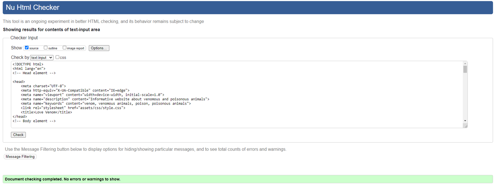

### Intermediate pages
- Vertebrates

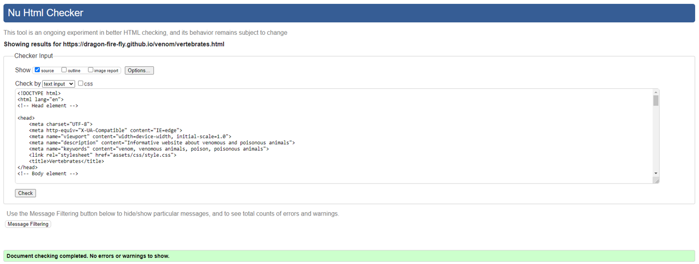

- Invertebrates

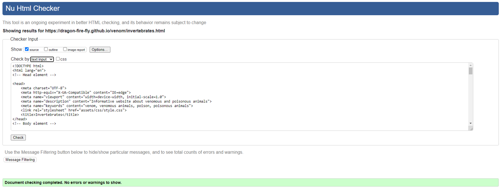

### Information pages
- Reptiles

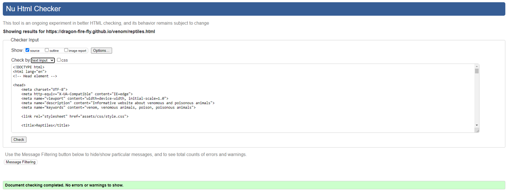

- Amphibians

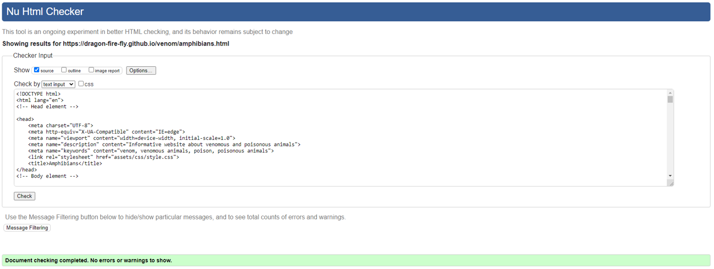

- Fish

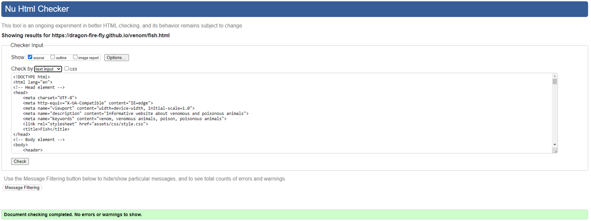

- Mammals and Birds

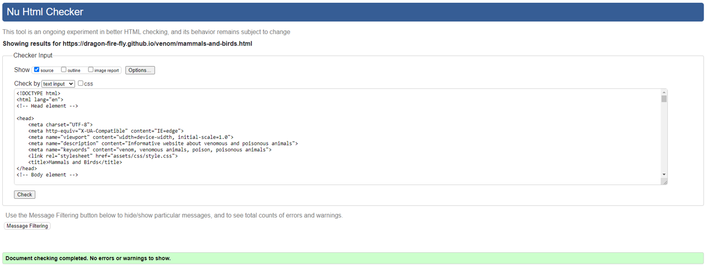

<!-- spiders
scorpions
insects
marine -->

### Contact page
- Contact Page
<!-- contact  -->
- Confirmation Page
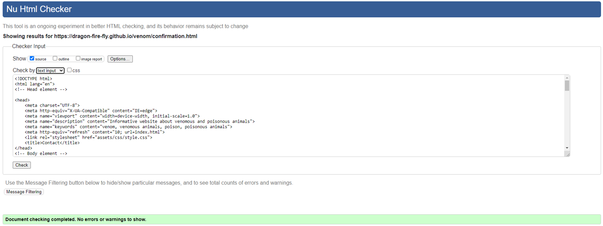

## CSS validation

## Lighthouse Tests
<!-- The SEO score is highly affected by the java menu using a fontawesome icon making the link "uncrawlable". Most of the page at or aroun 90% so deemed ok.-->
<!-- Could improve Performance scores by reducing size of image and/or changing file format to a next-gen format such as WebP or AVIF. Given the performance scores were still over 90% and the purpose of the website to serve high quality images that users may wish to download, these changes were not made. -->
For each Lighthouse Test, the page was tested in both mobile and desktop versions. Both scores are displayed below with the mobile scores followed by desktop:
### Home page
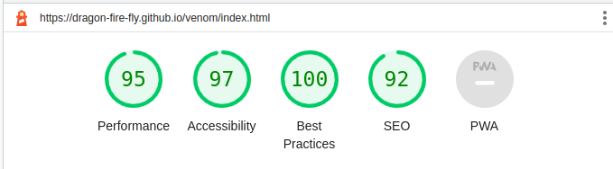
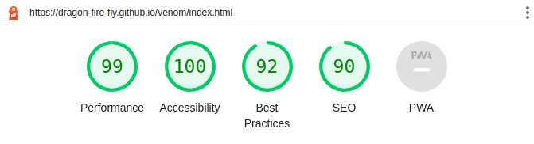

### Intermediate pages
- Vertebrates
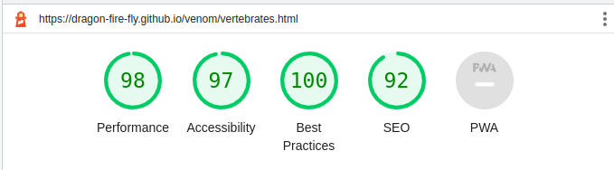
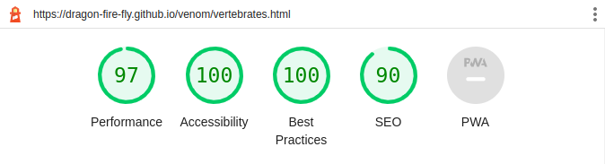

- Invertebrates

### Information page
- Reptiles
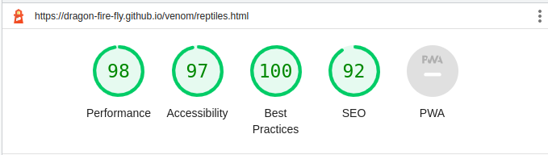
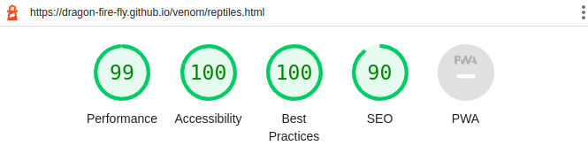

- Amphibians
(Bad SEO score)
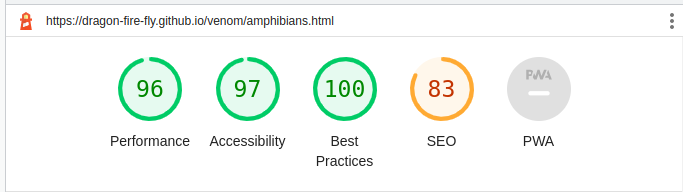
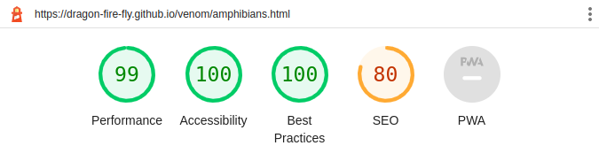

- Fish
(Bad SEO score)
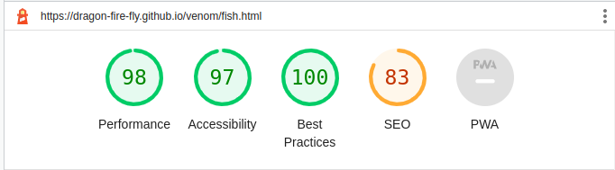
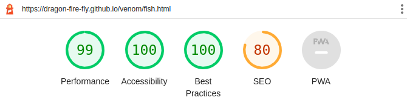

- Mammals and Birds

- Spiders
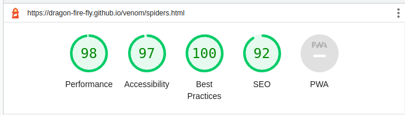
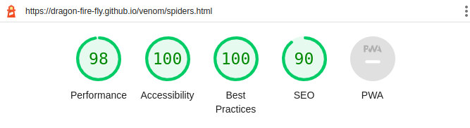

- Scorpions
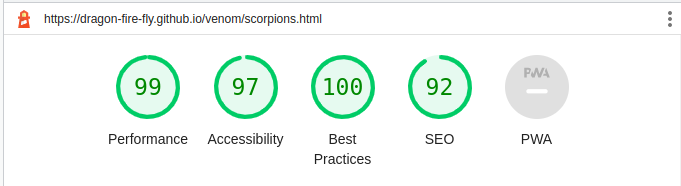
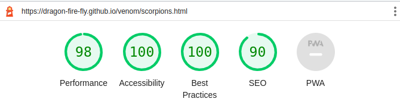

- Insects and Other Arthropods
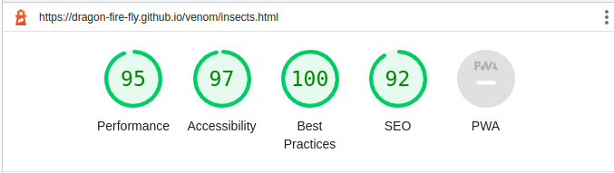
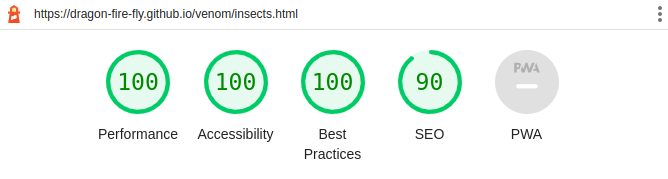

- Marine Invertebrates

### Contact page
- Contact Page
(bad score)
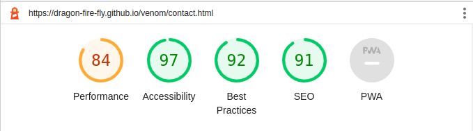
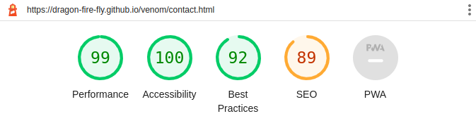

- Confirmation Page
(bad score)
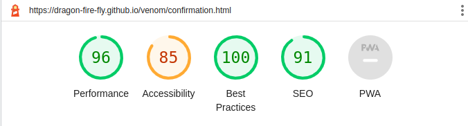
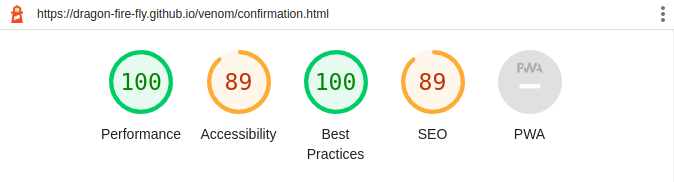

# Accessibility
The [Eightshapes](https://contrast-grid.eightshapes.com/?version=1.1.0&background-colors=&foreground-colors=%23FFFFFF%2C%20White%0D%0A%23000000%2C%20Black%0D%0A%23dde7c7%0D%0A%2382a89c%0D%0A%2373b8cc%0D%0A%2302789e%0D%0A%23003859%0D%0A%23126100%0D%0A&es-color-form__tile-size=compact&es-color-form__show-contrast=aaa&es-color-form__show-contrast=aa&es-color-form__show-contrast=aa18&es-color-form__show-contrast=dnp) contrast grid generator was used to assess suitability of chosen colour scheme to ensure good accessibility scores were achieved. The scores for all colour combinations used were at least 5.5 (pass, AA), and the combinations used for smaller texts scored at least 9 (pass, AAA)

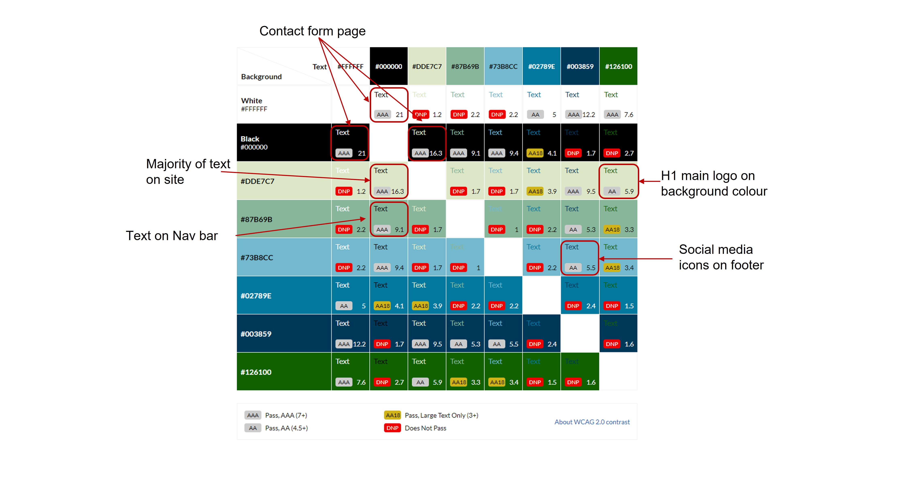

# Responsiveness

# Bug Fixes
## Overflow-x problem
Whilst testing the website, an x-overflow was discovered (a scrollbar appeared along the x-axis). 

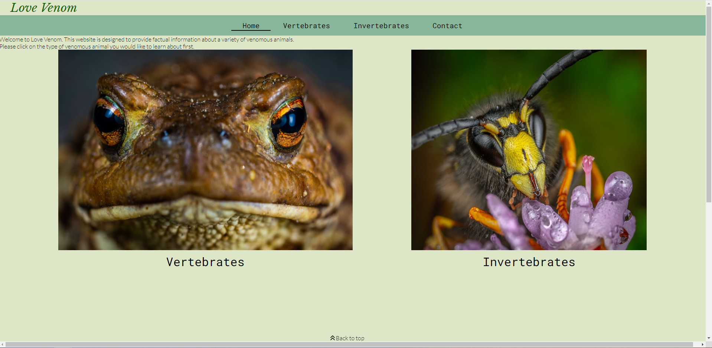

This bug was created when attempting to centre the "Back to top" element. The margin-left: -60px seemed to be causing the width of the footer to be larger than the width of the main body, as seen below:

This issue was fixed by removing the marign-left and using the code above to properly centre the "Back to top" element, using "fit content" and "margin: 0, auto" properties instead. This fixed the overflow-x issue.

## Unfixed Bugs

<!-- iPad landscape issue? -->