# Love Venom Testing

Click [here](README.md) to return back to the README.md

# Contents
* [**Browser Compatibility**](<#browser-compatibility>) 
* [**Code Validation**](<#code-validation>)  
    * [HTML Validation](<#html-validation>)  
    * [CSS Validation](<#css-validation>)  
    * [Lighthouse Tests](<#lighthouse-tests>)  
* [**Accessibility**](<#accessibility>)  
* [**Responsiveness**](<#responsiveness>)  
* [**Bug Fixes**](<#bug-fixes>)  
    * [Overflow-x issue](<#overflow-x-problem>)
    * [Map overlap issue](<#map-overlay-issue>)
    * [Unfixed Bugs](<#unfixed-bugs>)  

# Browser Compatibility
The website was tested on [Google Chrome](https://www.google.com/chrome/) and [Mozilla Firefox](https://www.mozilla.org/en-US/firefox/new/)

All screenshots in the [README.md file](README.md) were taken using the [Google Chrome](https://www.google.com/chrome/) browser and below are a few screenshots from [Mozilla Firefox](https://www.mozilla.org/en-US/firefox/new/):

Home page:
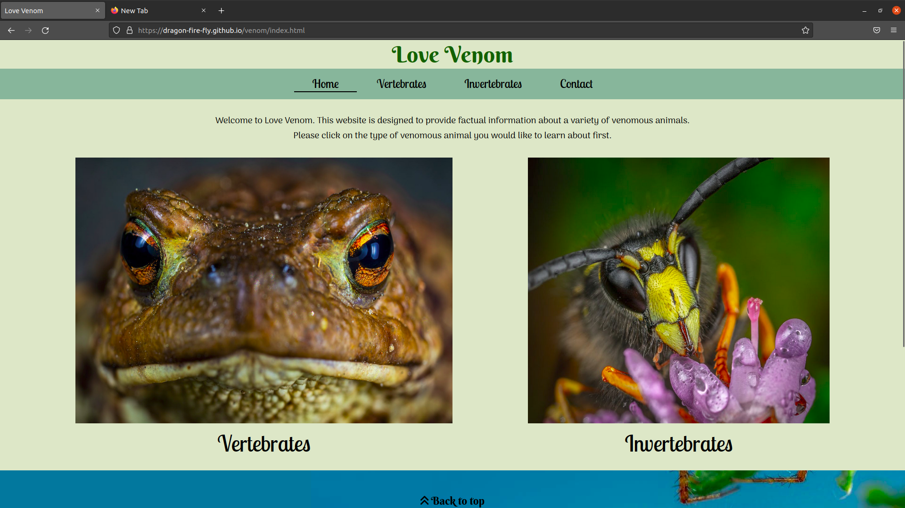

Vertebrates page:
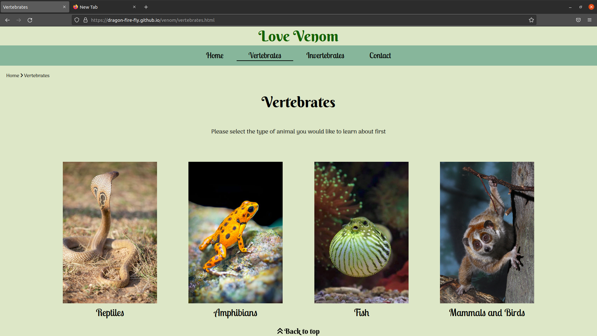

Contact page:
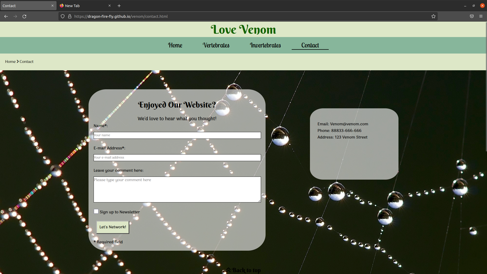

[Back to Top](#contents)

# Code Validation
## HTML Validation
The HTML code for each page was checked using the [W3 HTML validator](https://validator.w3.org/)
All pages passed validation with no errors.
### Home page
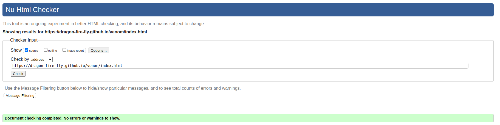

### Intermediate pages
- Vertebrates

- Invertebrates
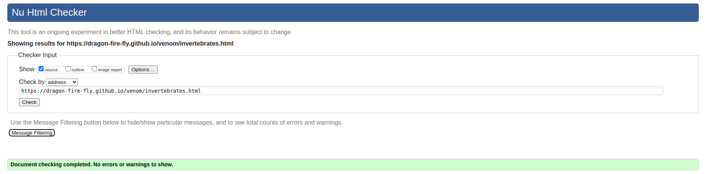

### Information pages
- Reptiles
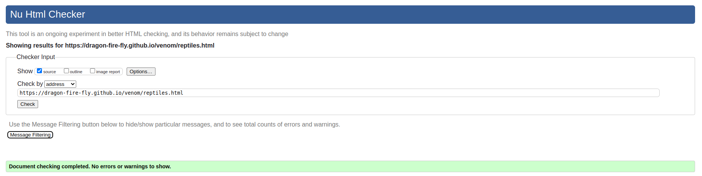

- Amphibians
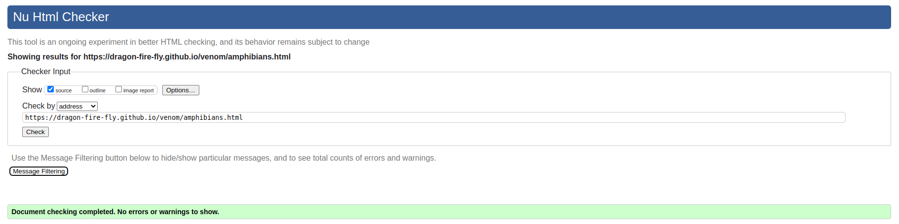

- Fish
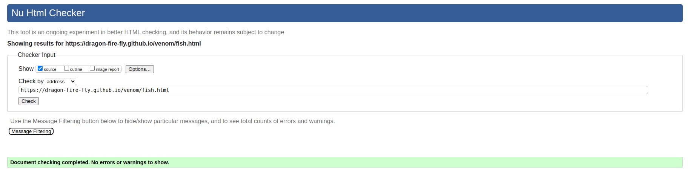

- Mammals and Birds
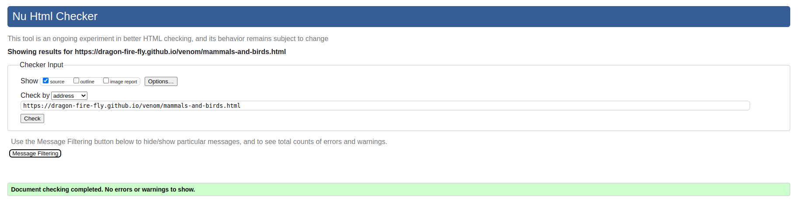

- Spiders
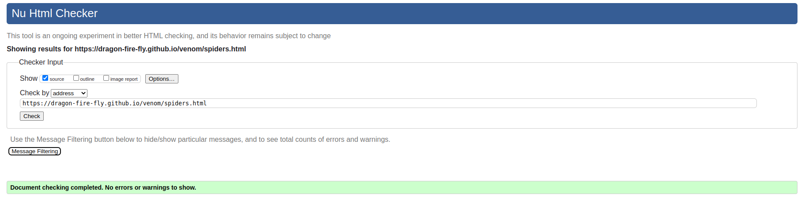

- Scorpions
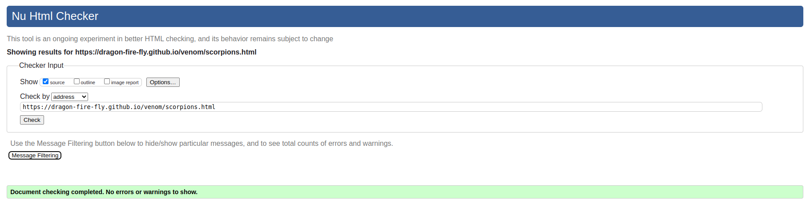

- Insects and Other Arthropods
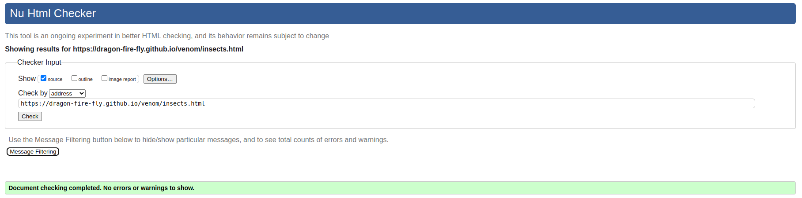

- Marine Invertebrates
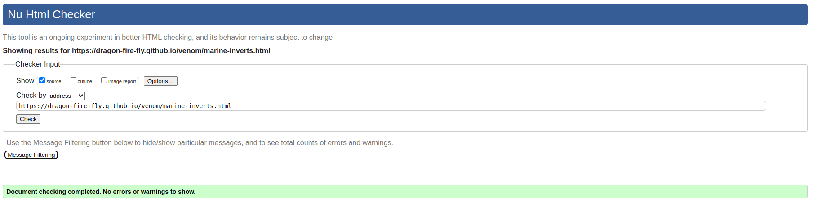

### Contact page
- Contact Page
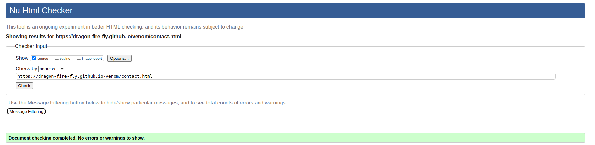
- Confirmation Page
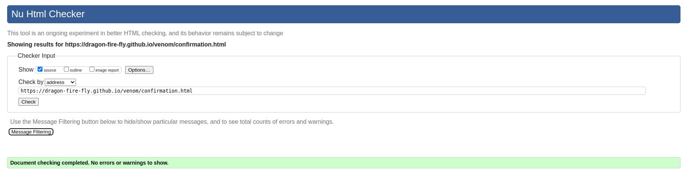

[Back to Top](#contents)

## CSS Validation
The CSS code was pasted into the [W3C Validation Service](https://jigsaw.w3.org/css-validator/) and passed with no errors.

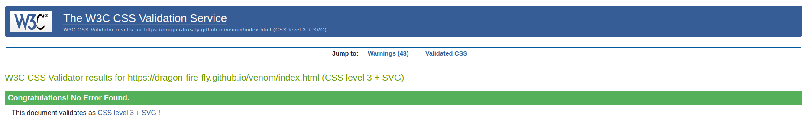

    

[Back to Top](#contents)

## Lighthouse Tests
Lighthouse tests were performed using the built in lighthouse tool in Google Chrome Developer Tools. The aim of running Lighthouse tests is to improve site performance, accessibility and usability. The tests also measure the site crawlability and how highly it is displayed in search results in a search engine (SEO score). Scores over 90 are deemed to be very good.  

The performance scores for most of the pages in this project could have been improved by reducing size of image and/or changing file format to a next-gen format such as WebP or AVIF. Given the performance scores were still over 90% and the purpose of the website to serve high quality images that users may wish to download, these changes were not made.  

The SEO score for many of the pages was highly affected by the inclusion of the JavaScript menu using a fontawesome icon making the link "uncrawlable". Most of the pages were at or around 90% so this was deemed acceptable.  

For each page of the website, Lightouhse Tests were performed in both mobile and desktop versions. Both scores are displayed below with the mobile scores followed by desktop:  

### Home page
  
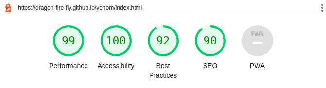    

### Intermediate pages
- Vertebrates  
  
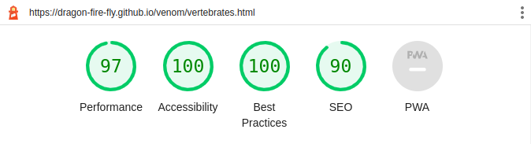  

- Invertebrates  
  
  

### Information page
- Reptiles  
  
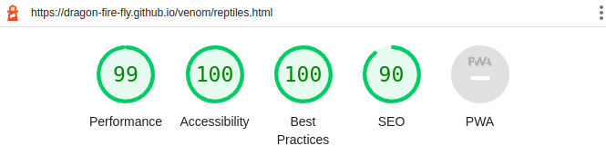  

- Amphibians  
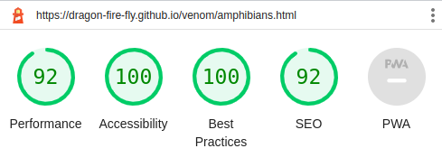  
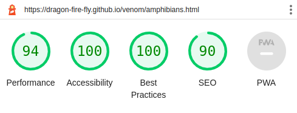  

A more descriptive link ("more detailed taxonomy details" instead of "click here") was added to the amphibian page to improve the SEO score from 83 (mobile) and 80 (desktop) to 92 (mobile) and 90 (desktop).

- Fish  
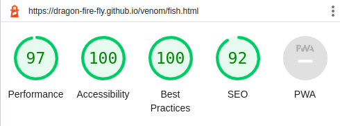  
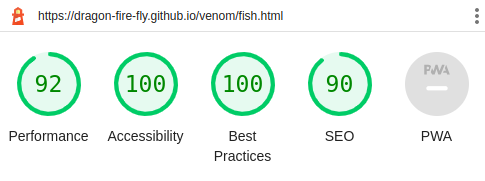  

A more descriptive link ("more about pufferfish genera" instead of "click here") was added to the amphibian page to improve the SEO score from 83 (mobile) and 80 (desktop) to 92 (mobile) and 90 (desktop).

- Mammals and Birds  
  
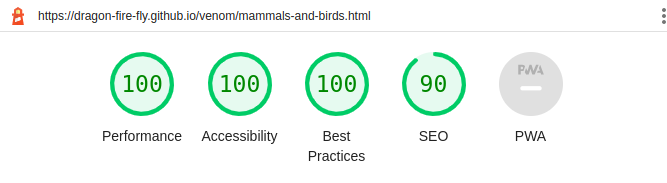  

- Spiders  
  
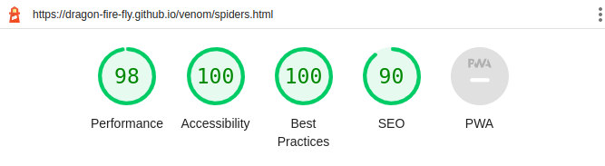  

- Scorpions  
  
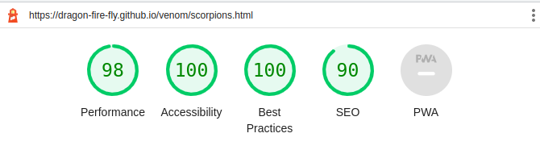  

- Insects and Other Arthropods  
  
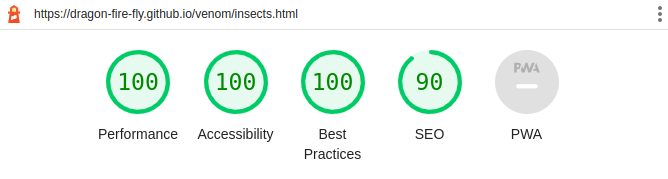  

- Marine Invertebrates  
  
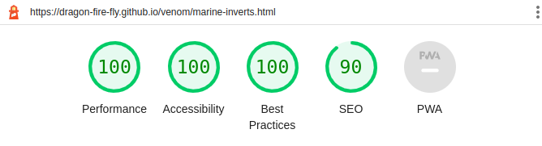  

### Contact page
- Contact Page  
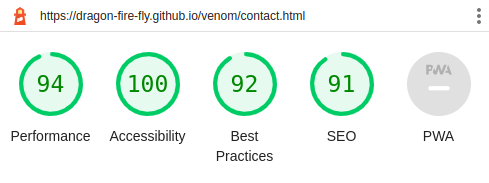  
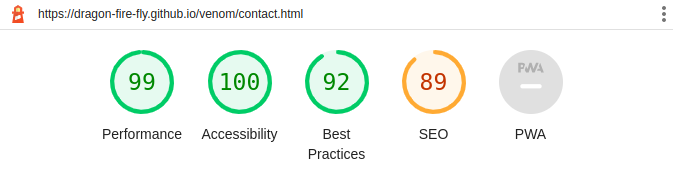  

The desktop version of the contact page had an SEO score of 89 due to the inclusion of the JavaScript menu using a fontawesome icon making the link "uncrawlable". I was unable to improve this score to be above 90 without removing the JavaScript menu. The inclusion of the menu and its effect on the overall user experience and layout of the site on mobile was deemed more important at this time.

- Confirmation Page  
  
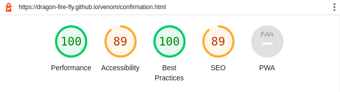

The desktop version of the confirmation page had an SEO score of 89 due to the inclusion of the JavaScript menu using a fontawesome icon making the link "uncrawlable". I was unable to improve this score to be above 90 without removing the JavaScript menu. The inclusion of the menu and its effect on the overall user experience and layout of the site on mobile was deemed more important at this time.

The accessibilty score was also below 90 (85 and 89 for mobile and desktop respectively) due to the redirect function included in the head element (<meta http-equiv="refresh" content="10; url=index.html">). This automatically redirects the user to index.html after 10 seconds and includes a link that users can click if they wish to be taken there automatically. 

The increase in user experience provided by this feature was deemed more important than the accessibility score as the page clearly explains that the user is about to be redirected and so users using a screen reader will know that this is about to happen.

[Back to Top](#contents)

# Accessibility
The [Eightshapes](https://contrast-grid.eightshapes.com/?version=1.1.0&background-colors=&foreground-colors=%23FFFFFF%2C%20White%0D%0A%23000000%2C%20Black%0D%0A%23dde7c7%0D%0A%2382a89c%0D%0A%2373b8cc%0D%0A%2302789e%0D%0A%23003859%0D%0A%23126100%0D%0A&es-color-form__tile-size=compact&es-color-form__show-contrast=aaa&es-color-form__show-contrast=aa&es-color-form__show-contrast=aa18&es-color-form__show-contrast=dnp) contrast grid generator was used to assess suitability of chosen colour scheme to ensure good accessibility scores were achieved. The scores for all colour combinations used were at least 5.5 (pass, AA), and the combinations used for smaller texts scored at least 9 (pass, AAA)

[Back to Top](#contents)

# Responsiveness
The site was designed using a "mobile first" approach. This mean that the basic CSS rules apply to smaller screen sizes and media queries change the content for larger screen sizes. In general the following break points were considered and used for the design of the website: 375px (medium size mobile phone), 750px (medium tablet in portrait), 950px (small desktop, laptop and tablet in landscape) and 1250px (larger desktop).

The site overall was tested using [Am I Responsive?](https://ui.dev/amiresponsive?url=https://dragon-fire-fly.github.io/venom/index.html). A screenshot is shown below:
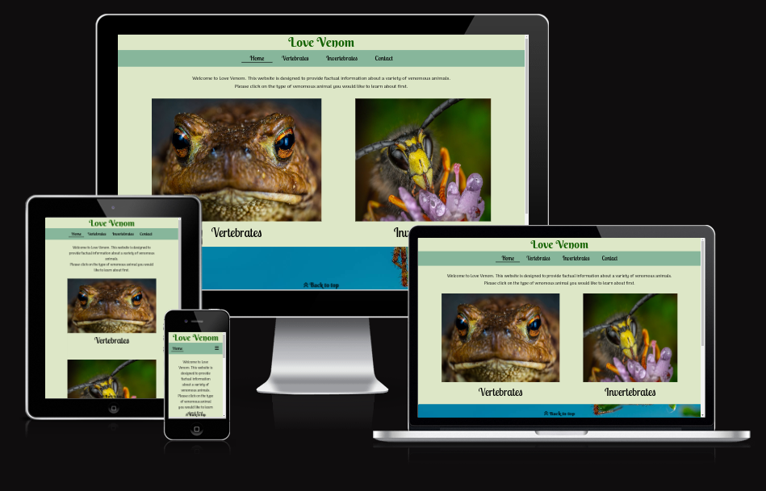

The index.html page appears like this on different screen sizes:
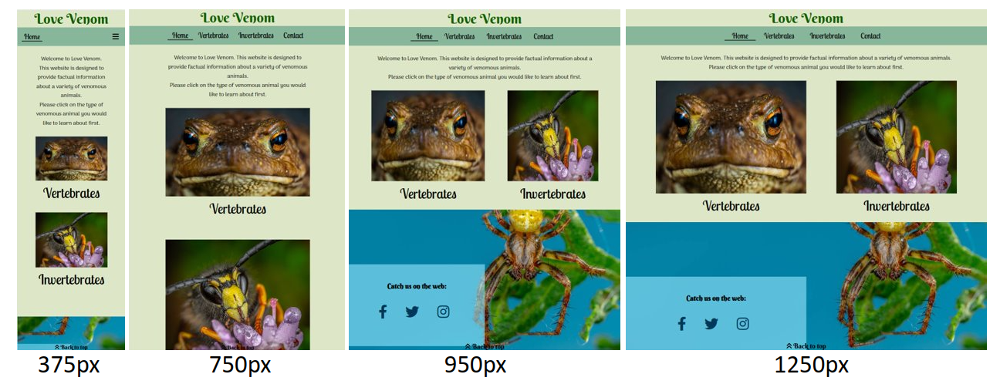

The majority of media queries were at screen sizes of 950px and above. In the original wireframe designs, an additional breakpoint for tablets was included (to be between approximately 750-950px), however, when this was tested, the icons for selecting animals on the intermediate page appeared too small, as shown below. Therefore, a larger (950px) breakpoint was selected here to stack the icons on top of one another:

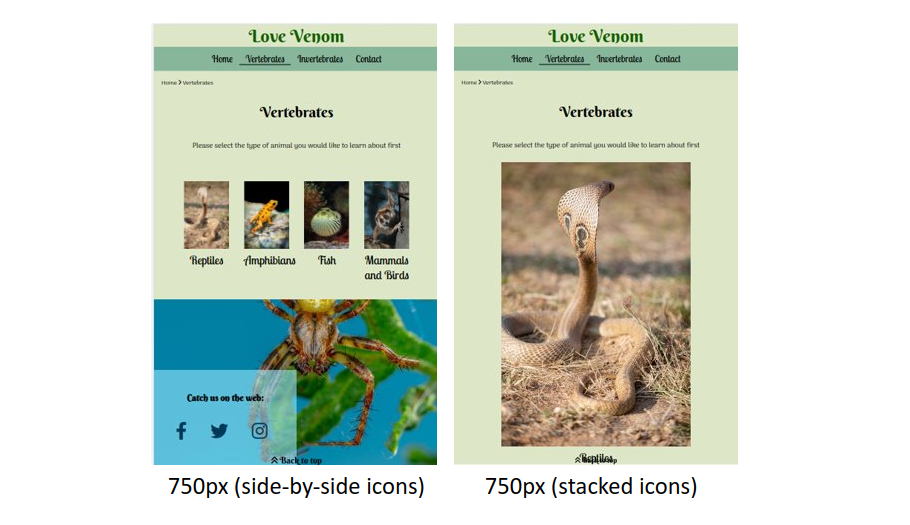

This effect was also seen on the individual animal pages as the photos appeared too small as the CSS grid layout accomodated for a larger block of text on screen sizes 750px and 960px. as shown below. Therefore the breakpoint selected for side-by-side text and images was 1250px.
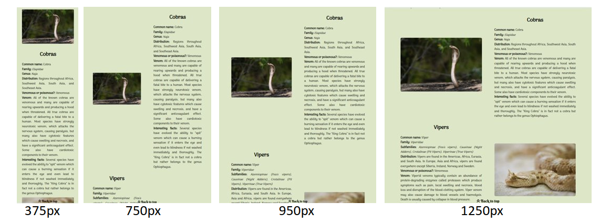

The optimised individual pages now appear like this:
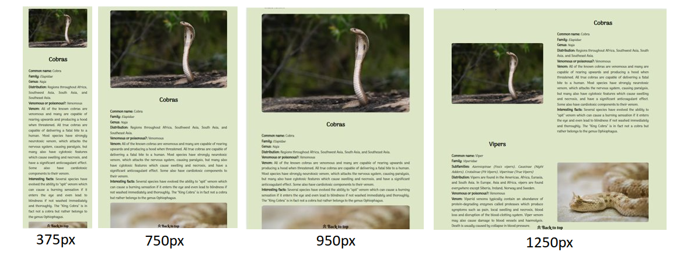

[Back to Top](#contents)

# Bug Fixes
## Overflow-x problem
Whilst testing the website, an x-overflow was discovered (a scrollbar appeared along the x-axis). 

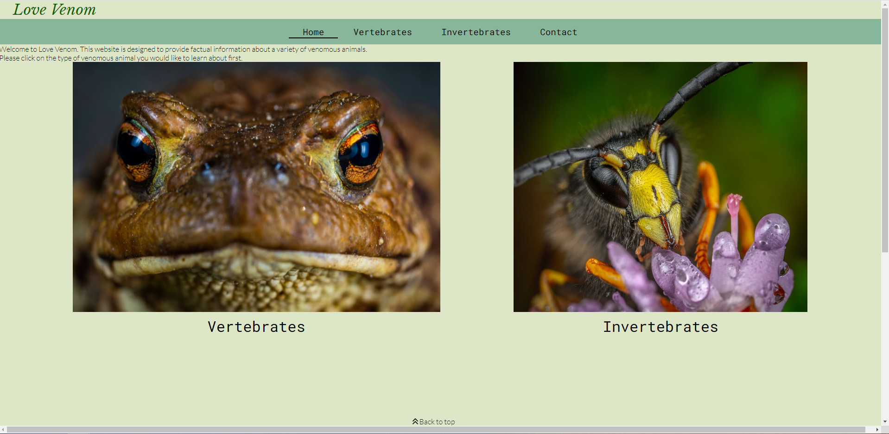

This bug was created when attempting to centre the "Back to top" element. The margin-left: -60px seemed to be causing the width of the footer to be larger than the width of the main body, as seen below:

This issue was fixed by removing the marign-left and using the code above to properly centre the "Back to top" element, using "fit content" and "margin: 0, auto" properties instead. This fixed the overflow-x issue.

## Map overlay issue

During development, the contact page was modified to move the map to the bottom of the page. During this move, a bug occured whereby the map was overlapping into the footer, as shown in the portrait and landscape mobile screenshots below.

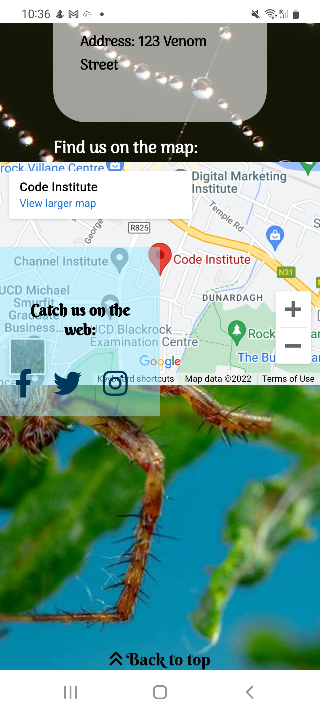

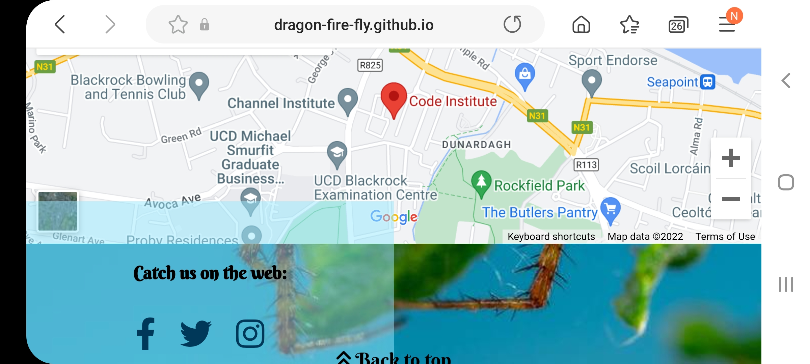

The source of this issue was due to the page originally being given a height value of 1000px to allow the spiderweb image to be shown correctly. A height of 1000px was no longer enough to display all the page elements within the CSS grid given to the page. By removing this 1000px height value and redesigning the CSS grid, the map was shown correctly and was no longer overlapping into the footer.

## Unfixed Bugs

There are no remaining bugs that I am aware of.

[Back to Top](#contents)